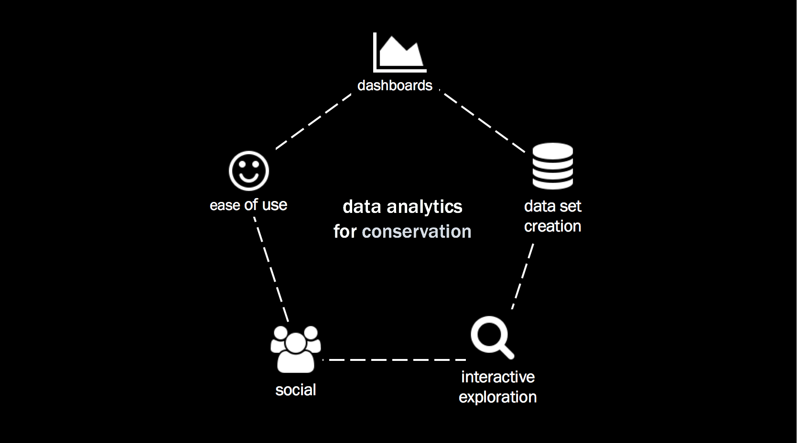

# Data rich, insights poor

Data Science, “the responsible use of data for decision making”, has been embraced by companies in many fields for optimizing their processes and improving management resources. The similarities with good practices in conservation are striking because successful management of natural resources invariably involves making data-driven decisions in complex shifting social and ecological settings.

To support this decision making, environmental management agencies often establish monitoring programs that provide information about the status and trends of the resources of interest. While monitoring and management frameworks outlining how data can be used for decision making are well established, cases of data being collected—but not used—occur too frequently. Regrettably, small or underfunded organizations are more likely to be in this “data rich but insight poor” situation. Managers are often acutely aware of this disconnect but are unable to address its root because data management, manipulation, and analysis, are often more complex and expensive than anticipated.

 

  

 

**This repo contains code for the website used in a workshop**. In the workshop we show how relatively simple data science tools can be used to bridge this gap and create an efficient workflow of monitoring data. With the right systems in place, automated reports and user-friendly interactive web apps can provide near real-time statistical summaries and visualizations, not only of the data being collected but also, of how it relates to the actual resource(s) being managed and associated conservation values. Managers and scientific staff can have a direct and immediate overview that allows to quickly identify areas requiring improvement or more in-depth analysis.

We will outline both the general principles and the technical aspects of efficient data management and demonstrate, using examples, how NGOs, citizen groups, and virtually any data-dependent agency can benefit from a data science perspective.
